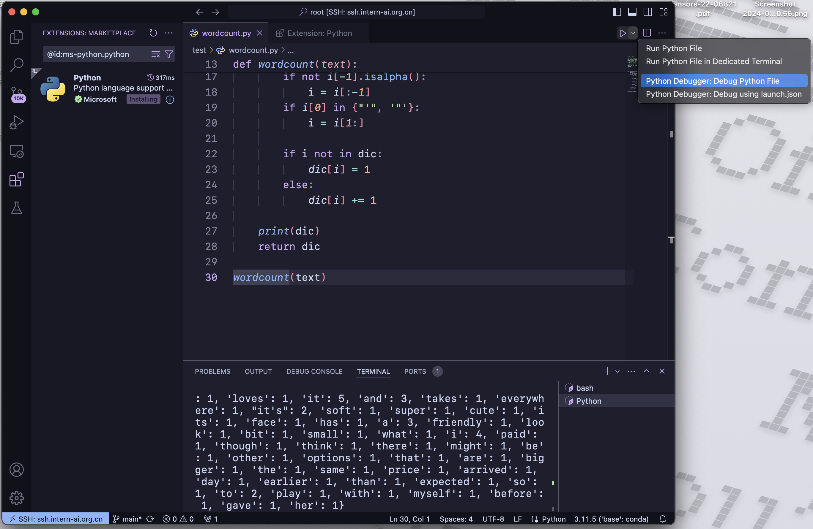
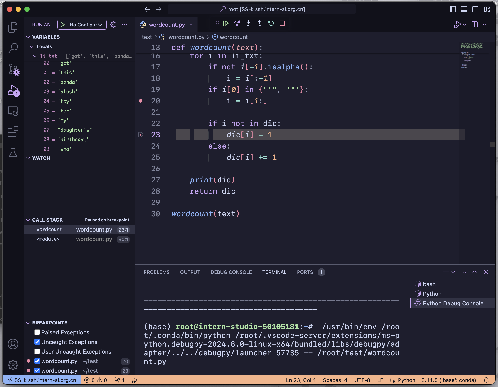

## task1

### L0 Linux Task


### L0 Python

#### wordcount task
```{python}
text = """
Got this panda plush toy for my daughter's birthday,
who loves it and takes it everywhere. It's soft and
super cute, and its face has a friendly look. It's
a bit small for what I paid though. I think there
might be other options that are bigger for the
same price. It arrived a day earlier than expected,
so I got to play with it myself before I gave it
to her.
"""


def wordcount(text):
    dic = {}
    li_txt = text.lower().split()
    for i in li_txt:
        if not i[-1].isalpha():
            i = i[:-1]
        if i[0] in {"'", '"'}:
            i = i[1:]

        if i not in dic:
            dic[i] = 1
        else:
            dic[i] += 1

    print(dic)
    return dic


wordcount(text)
```

#### Debug


there is no error


